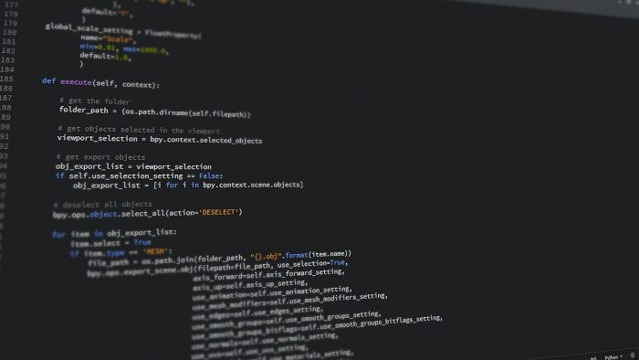

# Meus cursos de Programação
> Aqui encontra-se meus rascunhos e exercícios de aprendizados sobre programação.

A idéia é obter um guia de consulta rápida para relembrar todo o meu passo a passo na aprendizagem de programação, 23 cursos na Udemy que desejo finalizar. Um desafio grande porém bem empolgante.

## Programação para leigos e informática básica

## Linux

## Algoritimos e lógica de programação

## Git e GitHub

## Python

## Bootstrap

## Banco de dados SQL e NoSQL

## Padrão de projetos

## Django

## AWS

## Docker

## Programação concorrente e assíncrona

## Visualização de dados 2D e 3D com Python, Matplotlib e Vpython

## Java

## JavaScript

## Computação em nuvem

## C

## Orquestração de Conteiners com Kubernetes

## C#

## ASP .net

## React
